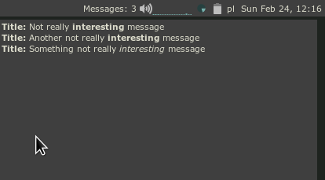

# Notifications widget

Collects notifications shown by `naughty`.



## Features

* Shows the number of already collected in the top.
* Clicking the left button shows/hide a widget with titles and messages
* Clicking the right button resets the state. (Mark as read?)
* Mouse wheel - scrolls messages.

## Installation

1. Clone the library (e.g. into `~/.config/awesome/`)
2. Edit the `rc.lua`
    1. Load the library `local notifications_widget = require('notifications-widget.counter')`
    2. Connect to the `noughty` callback
    ```lua
    naughty.config.notify_callback = function(args)
        notifications_widget:new_message(args)
        return args
    end
    ```

3. To test, send a message from the terminal
```
$ notify-send "Title" "Something not really <i>interesting</i> message"
```

## TODO

1. Show messages on the same screen as mouse - DONE
2. Remove messages after clicking on the widget - DONE
3. Show title in the box - DONE
4. Indicate that there is more messages there
5. Show icons
